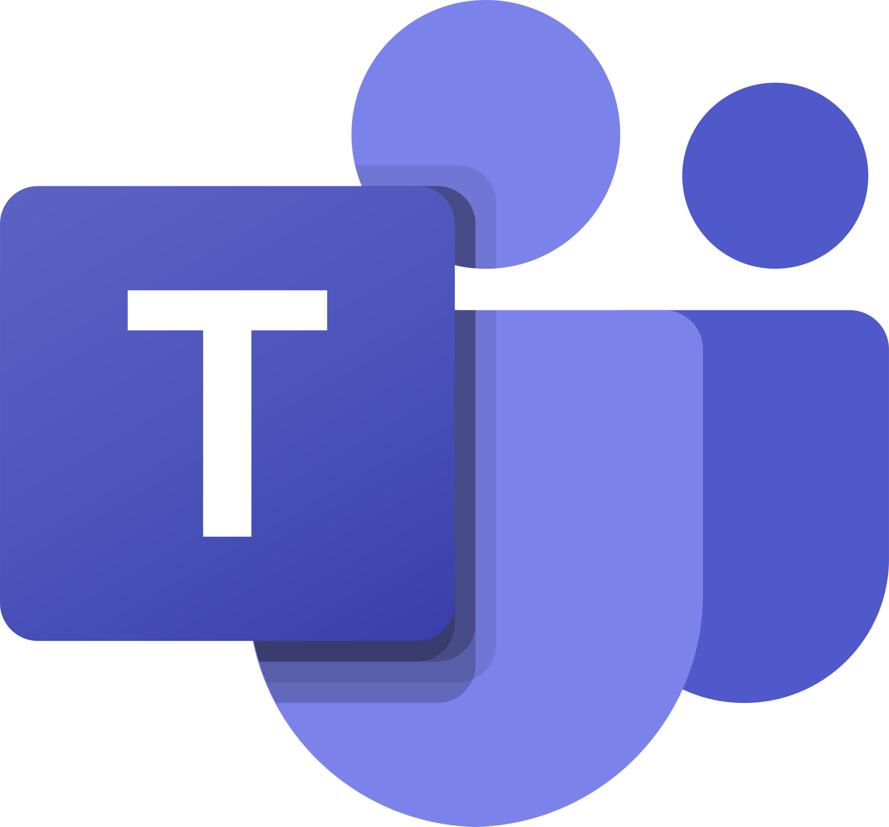

<div align="center">
  
<picture>
  <source media="(prefers-color-scheme: dark)" srcset="resources/what-i-do.svg">
  
</picture>

# Hi! I'm Shuvo &nbsp;

<a href="https://git.io/typing-svg"></a>

### `▸` Automation Lead &nbsp;|&nbsp; AI Agents &nbsp;|&nbsp; Autonomous Engineering

<p align="center">
  <a href="https://www.linkedin.com/in/mohammadshuvoali" target="_blank"></a>
  <a href="mailto:shuvo.a@webalive.com.au"></a>
  <a href="https://www.leetcode.com/shuvo4o4" target="_blank"></a>
  <a href="https://github.com/MohammadShuvoAli" target="_blank"></a>
</p>

</div>

---

## `▸` About Me

```yaml
name:            Mohammad Shuvo Ali
location:        Dhaka, Bangladesh
role:            Automation Lead @ WebAlive
education:       CSE - AIUB

focus:           AI-driven automation & autonomous QA
specialization:  [AI Agents, Workflow Automation, Playwright]

expertise:
  - Requirements Engineering & Spec Translation
  - AI-Driven QA Architecture
  - MCP-Powered Agentic Workflows
  - Playwright at Enterprise Scale
  - Auto-Reporting Pipelines (Jira / Confluence)
  - Team Training & Enablement
  - End-to-End Automation (Web · API · Mobile · Desktop)
  - CI/CD-Integrated Quality Pipelines
```


## `▸` Worked With

<div align="center">

<table>
<tr>
<td align="center" width="140"></td>
<td align="center" width="140"></td>
<td align="center" width="140"><picture><source media="(prefers-color-scheme: dark)" srcset="resources/clients/steritech.png"></picture></td>
<td align="center" width="140"></td>
</tr>
<tr>
<td align="center" width="140"></td>
<td align="center" width="140"><picture><source media="(prefers-color-scheme: dark)" srcset="resources/clients/webcommander.png"></picture></td>
<td align="center" width="140"></td>
<td align="center" width="140"><sub><i>… and more</i></sub></td>
</tr>
</table>

<sub><i>Enterprise platforms across Web, API, Mobile &amp; Desktop.</i></sub>

</div>

---

## `▸` Technical Arsenal

### `›` AI &amp; Autonomous Tooling

<div align="center">
<table>
<tr>
<td align="center" width="90"><br/><sub><b>Claude</b></sub></td>
<td align="center" width="90"><br/><sub><b>Codex</b></sub></td>
<td align="center" width="90"><br/><sub><b>Cursor</b></sub></td>
</tr>
<tr>
<td align="center" width="90"><br/><sub><b>AWS Bedrock</b></sub></td>
<td align="center" width="90"><br/><sub><b>n8n</b></sub></td>
<td align="center" width="90"><br/><sub><b>MCP</b></sub></td>
</tr>
</table>
</div>

### `›` Automation &amp; Testing Tools

<div align="center">
<table>
<tr>
<td align="center" width="90"><br/><sub><b>Playwright</b></sub></td>
<td align="center" width="90"><br/><sub><b>Cypress</b></sub></td>
<td align="center" width="90"><br/><sub><b>Selenium</b></sub></td>
<td align="center" width="90"><br/><sub><b>Appium</b></sub></td>
</tr>
<tr>
<td align="center" width="90"><br/><sub><b>PyWinAuto</b></sub></td>
<td align="center" width="90"><br/><sub><b>Postman</b></sub></td>
<td align="center" width="90"><br/><sub><b>Rest Assured</b></sub></td>
<td align="center" width="90"><sub><i>… and more</i></sub></td>
</tr>
</table>
</div>

### `›` Frameworks &amp; Methodologies

<div align="center">
<table>
<tr>
<td align="center" width="90"><br/><sub><b>Jest</b></sub></td>
<td align="center" width="90"><br/><sub><b>Mocha</b></sub></td>
<td align="center" width="90"><br/><sub><b>Pytest</b></sub></td>
<td align="center" width="90"><br/><sub><b>Robot</b></sub></td>
</tr>
<tr>
<td align="center" width="90"><br/><sub><b>Cucumber</b></sub></td>
<td align="center" width="90"><br/><sub><b>Behave</b></sub></td>
<td align="center" width="90"><br/><sub><b>BDD / POM</b></sub></td>
<td align="center" width="90"><sub><i>… and more</i></sub></td>
</tr>
</table>
</div>

### `›` Performance Testing

<div align="center">
<table>
<tr>
<td align="center" width="90"><br/><sub><b>JMeter</b></sub></td>
<td align="center" width="90"><br/><sub><b>K6</b></sub></td>
</tr>
</table>
</div>

### `›` Programming Languages

<div align="center">
<table>
<tr>
<td align="center" width="90"><br/><sub><b>TypeScript</b></sub></td>
<td align="center" width="90"><br/><sub><b>JavaScript</b></sub></td>
<td align="center" width="90"><br/><sub><b>Python</b></sub></td>
</tr>
<tr>
<td align="center" width="90"><br/><sub><b>Java</b></sub></td>
<td align="center" width="90"><br/><sub><b>PHP</b></sub></td>
</tr>
</table>
</div>

### `›` Database &amp; Query Languages

<div align="center">
<table>
<tr>
<td align="center" width="90"><br/><sub><b>MySQL</b></sub></td>
<td align="center" width="90"><br/><sub><b>Oracle</b></sub></td>
<td align="center" width="90"><br/><sub><b>SQL</b></sub></td>
<td align="center" width="90"><br/><sub><b>PL/SQL</b></sub></td>
</tr>
</table>
</div>

### `›` DevOps &amp; CI/CD

<div align="center">
<table>
<tr>
<td align="center" width="90"><br/><sub><b>Git</b></sub></td>
<td align="center" width="90"><br/><sub><b>GitHub</b></sub></td>
<td align="center" width="90"><br/><sub><b>GH Actions</b></sub></td>
</tr>
<tr>
<td align="center" width="90"><br/><sub><b>Bitbucket</b></sub></td>
<td align="center" width="90"><br/><sub><b>Jenkins</b></sub></td>
<td align="center" width="90"><br/><sub><b>Docker</b></sub></td>
</tr>
</table>
</div>

### `›` Project Management &amp; Collaboration

<div align="center">
<table>
<tr>
<td align="center" width="90"><br/><sub><b>Jira</b></sub></td>
<td align="center" width="90"><br/><sub><b>Confluence</b></sub></td>
<td align="center" width="90"><br/><sub><b>ActiveCollab</b></sub></td>
</tr>
<tr>
<td align="center" width="90"><br/><sub><b>Slack</b></sub></td>
<td align="center" width="90"><br/><sub><b>MS Teams</b></sub></td>
<td align="center" width="90"><br/><sub><b>Notion</b></sub></td>
</tr>
</table>
</div>


## `▸` GitHub Achievements

<div align="center">
  <picture>
    <source media="(prefers-color-scheme: dark)" srcset="https://github-profile-trophy.vercel.app/?username=mohammadshuvoali&theme=tokyonight&no-frame=true&row=1&column=7">
    
  </picture>
</div>

---

## `▸` GitHub Statistics

<div align="center">

<picture>
  <source media="(prefers-color-scheme: dark)" srcset="https://github-readme-stats-sigma-five.vercel.app/api?username=mohammadshuvoali&show_icons=true&theme=tokyonight&hide_border=true&count_private=true&bg_color=1a1b27&title_color=70a5fd&icon_color=bf91f3&text_color=38bdae">
  
</picture>
<picture>
  <source media="(prefers-color-scheme: dark)" srcset="https://streak-stats.demolab.com/?user=mohammadshuvoali&theme=tokyonight&hide_border=true&background=1a1b27&ring=70a5fd&fire=bf91f3&currStreakLabel=bf91f3">
  
</picture>

</div>

<div align="center">
  <picture>
    <source media="(prefers-color-scheme: dark)" srcset="https://github-readme-stats-sigma-five.vercel.app/api/top-langs/?username=mohammadshuvoali&layout=compact&theme=tokyonight&hide_border=true&langs_count=8&bg_color=1a1b27&title_color=70a5fd&text_color=38bdae">
    
  </picture>
</div>

---

<div align="center">

### `▸` Let's connect and build something autonomous.

<a href="https://www.linkedin.com/in/mohammadshuvoali" target="_blank"></a>
<a href="mailto:mohammadshuvoali@gmail.com"></a>

<sub><b>GMT+6 · usually replying while a test suite runs</b></sub>

</div>
