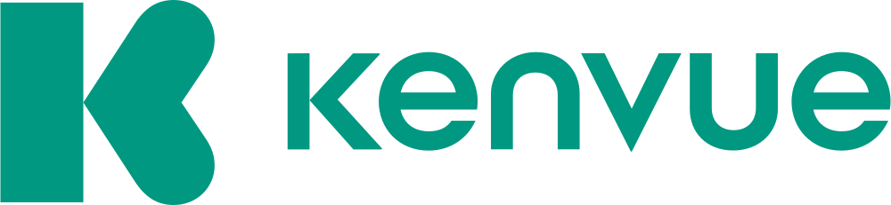

<picture>
  <source media="(prefers-color-scheme: dark)" srcset="resources/hero.svg">
  
</picture>

<a href="https://shuvoali.pages.dev">Portfolio</a> &nbsp;·&nbsp;
<a href="https://www.linkedin.com/in/mohammadshuvoali">LinkedIn</a> &nbsp;·&nbsp;
<a href="https://www.leetcode.com/shuvo4o4">LeetCode</a> &nbsp;·&nbsp;
<a href="mailto:mohammadshuvoali@gmail.com">Email</a>

## `▸` What I do

I help teams ship faster by turning brittle, manual process into systems they can trust — Lead QA who treats automation as engineering, not an afterthought. Lately most of that work is agent-driven: Claude, Codex, n8n, and a lot of TypeScript doing the parts that used to eat a sprint.

<picture>
  <source media="(prefers-color-scheme: dark)" srcset="resources/what-i-do.svg">
  
</picture>

## `▸` Selected work

Enterprise platforms where I owned the full quality loop. On each one I ran **Web, UI, API and Performance** testing end-to-end — translating requirements into testable specs — and built the **CI/CD automation pipeline** that gated every release.

<table>
<tr>
<td align="center" valign="middle" width="150"><picture><source media="(prefers-color-scheme: dark)" srcset="resources/clients/eventbookings-dark.svg"></picture></td>
<td align="center" valign="middle" width="150"><picture><source media="(prefers-color-scheme: dark)" srcset="resources/clients/exsited-dark.svg"></picture></td>
<td align="center" valign="middle" width="150"><picture><source media="(prefers-color-scheme: dark)" srcset="resources/clients/webcommander.png"></picture></td>
<td align="center" valign="middle" width="150"></td>
</tr>
<tr>
<td align="center" valign="middle" width="150"></td>
<td align="center" valign="middle" width="150"><picture><source media="(prefers-color-scheme: dark)" srcset="resources/clients/steritech.png"></picture></td>
<td align="center" valign="middle" width="150"></td>
<td align="center" valign="middle" width="150"><a href="https://shuvoali.pages.dev/projects"><b>+ more</b></a></td>
</tr>
</table>

## `▸` What I build with

The stack I actually reach for, grouped by the job it does — and increasingly, the one my agents reach for on my behalf.

#### `›` AI &amp; Agents

<table>
<tr>
<td align="center" width="96"> <b>Claude</b></td>
<td align="center" width="96"> <b>Codex</b></td>
<td align="center" width="96"> <b>Cursor</b></td>
</tr>
<tr>
<td align="center" width="96"> <b>Bedrock</b></td>
<td align="center" width="96"> <b>n8n</b></td>
<td align="center" width="96"> <b>MCP</b></td>
</tr>
</table>

#### `›` Automation

<table>
<tr>
<td align="center" width="96"> <b>Playwright</b></td>
<td align="center" width="96"> <b>Cypress</b></td>
<td align="center" width="96"> <b>Selenium</b></td>
</tr>
<tr>
<td align="center" width="96"> <b>Appium</b></td>
<td align="center" width="96"> <b>PyWinAuto</b></td>
</tr>
</table>

#### `›` API &amp; Performance

<table><tr>
<td align="center" width="96"> <b>Postman</b></td>
<td align="center" width="96"> <b>Rest Assured</b></td>
<td align="center" width="96"> <b>JMeter</b></td>
<td align="center" width="96"> <b>K6</b></td>
</tr></table>

#### `›` CI/CD &amp; DevOps

<table>
<tr>
<td align="center" width="96"> <b>Jenkins</b></td>
<td align="center" width="96"> <b>Docker</b></td>
<td align="center" width="96"> <b>GH Actions</b></td>
</tr>
<tr>
<td align="center" width="96"> <b>Bitbucket</b></td>
<td align="center" width="96"> <b>Git</b></td>
</tr>
</table>

<b>Languages</b> &nbsp;TypeScript · JavaScript · Python · Java · PHP &nbsp;&nbsp;|&nbsp;&nbsp; <b>Frameworks</b> &nbsp;Jest · Mocha · Pytest · Robot · Cucumber · Behave (BDD / POM) 
<b>Data</b> &nbsp;MySQL · Oracle · SQL / PL-SQL &nbsp;&nbsp;|&nbsp;&nbsp; <b>Ship &amp; track</b> &nbsp;Jira · Confluence · Slack · MS Teams · Notion

### `▸` CI/CD pipelines that gate releases on evidence, not vibes.

Hiring, building something agentic, or just curious about agent-driven QA? Drop me a line.

<a href="https://shuvoali.pages.dev">Portfolio</a> &nbsp;·&nbsp;
<a href="https://www.linkedin.com/in/mohammadshuvoali">LinkedIn</a> &nbsp;·&nbsp;
<a href="mailto:mohammadshuvoali@gmail.com">mohammadshuvoali@gmail.com</a>

<b>GMT+6 · usually replying while a test suite runs.</b>

<i>All tests passed before this shipped. Yes, even the flaky one.</i>

